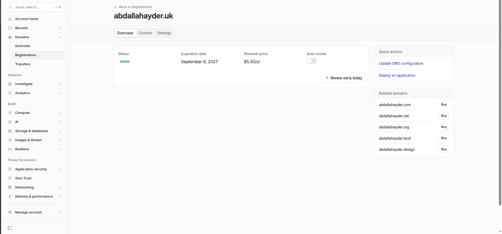
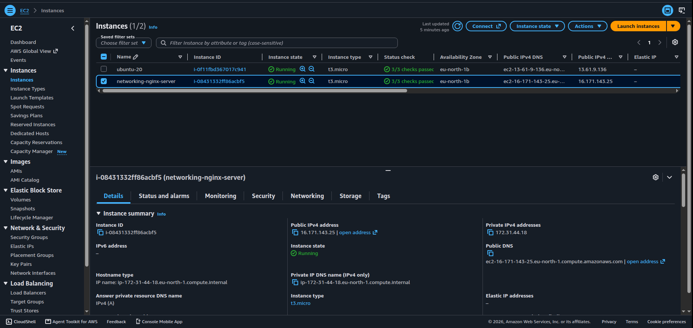
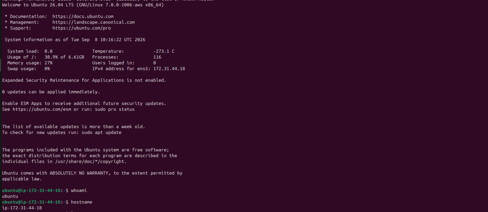
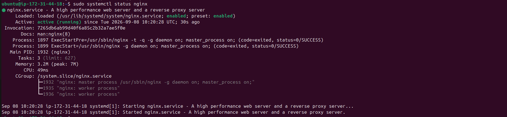
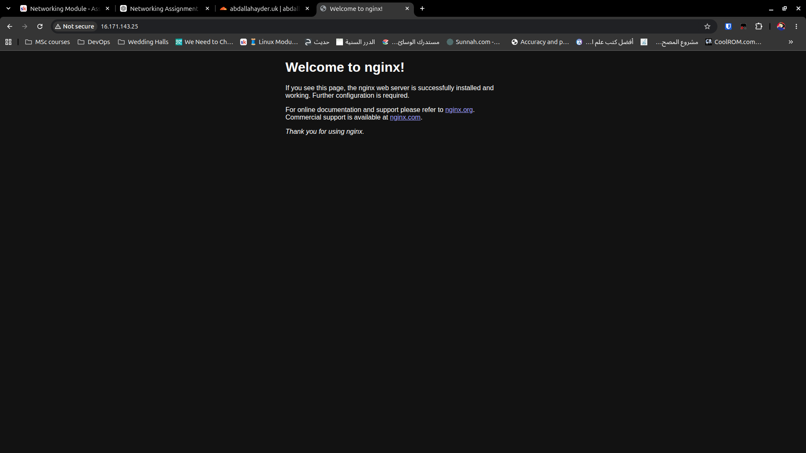
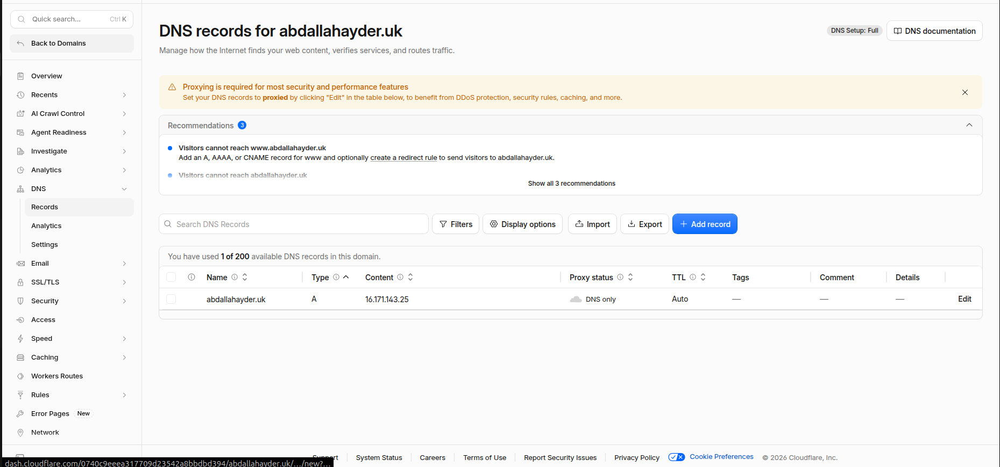
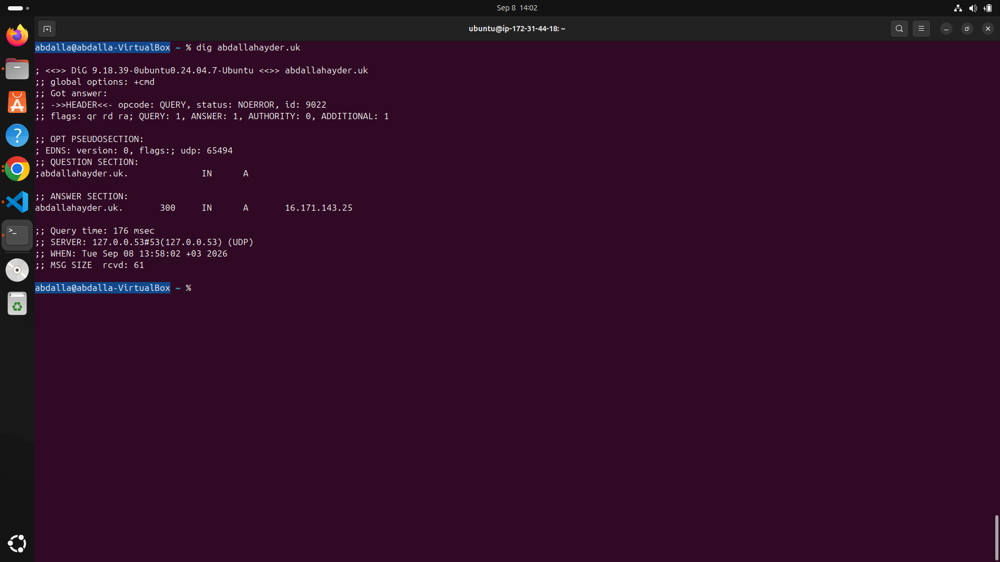
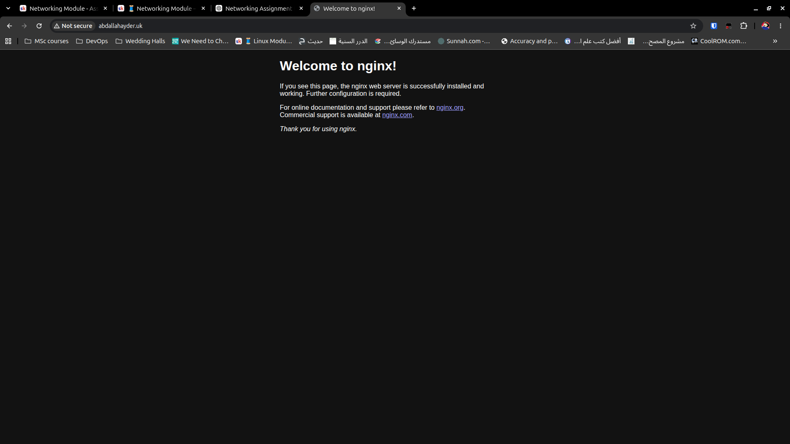

# Networking Module Project

## Project Overview

This project was completed as part of the Networking module in my DevOps learning journey.

The objective was to deploy an NGINX web server on an AWS EC2 instance, configure DNS using a custom domain, and make the web server accessible through that domain.

## Architecture

The final setup follows this flow:

```text
User Browser
    |
    | HTTP
    v
abdallahhayder.uk
    |
    | DNS A Record
    v
16.171.143.25
    |
    | TCP Port 80
    v
AWS Security Group
    |
    v
EC2 Ubuntu Server
    |
    v
NGINX
```

## Technologies Used

- AWS EC2
- Ubuntu Server
- NGINX
- Cloudflare DNS
- SSH
- Linux CLI
- Git & GitHub

## What I Built

- Registered a custom domain using Cloudflare
- Launched an Ubuntu EC2 instance in AWS
- Configured a security group for SSH and HTTP traffic
- Connected to the EC2 instance using SSH
- Installed and started NGINX
- Tested NGINX locally using `curl`
- Tested the web server using the EC2 public IPv4 address
- Created an A record pointing the domain to the EC2 public IPv4 address
- Verified DNS resolution using `dig`
- Successfully accessed the NGINX page using my custom domain

## Screenshots

### 1. Domain Registration



### 2. EC2 Instance Running



### 3. SSH Connection



### 4. NGINX Running



### 5. NGINX via Public IP



### 6. DNS A Record



### 7. DNS Resolution



### 8. Domain Successfully Loading NGINX



## Key Networking Concepts Applied

- Public and private IP addressing
- DNS resolution
- A records
- TCP ports
- HTTP
- SSH
- Security groups
- CIDR notation
- Client-server communication
- Basic troubleshooting

## Troubleshooting Approach

I tested the setup layer by layer:

1. Confirmed that NGINX was running on the EC2 instance.
2. Tested NGINX locally using `curl localhost`.
3. Tested the EC2 public IP in a browser.
4. Verified the DNS A record using `dig`.
5. Tested the full domain in the browser.

This helped isolate each part of the network path and confirm where connectivity was working.

## What I Learned

This project helped me understand how DNS, IP addressing, ports, security groups, HTTP and cloud infrastructure work together.

The biggest takeaway was understanding the full path from entering a domain name in a browser to the request reaching a web server running inside an AWS EC2 instance.

## Commands Used

See [commands.md](commands.md) for the main Linux and networking commands used during the project.
